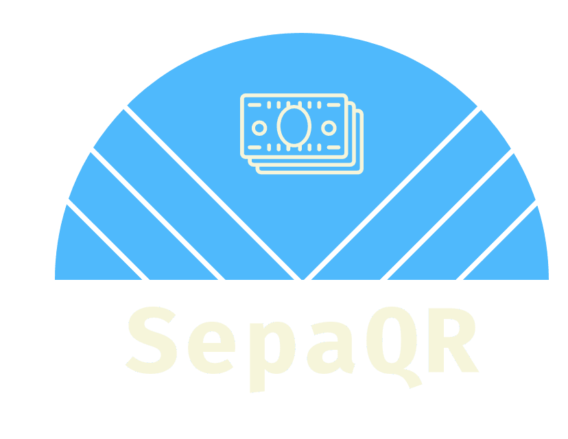

<!-- PROJECT LOGO -->
<br />
<div align="center">
  <a href="https://github.com/c0dr/sepaqr">
    
  </a>

<h3 align="center">SEPA QR</h3>

  <p align="center">
    Easily generate a QR code for SEPA money transfer. 100% client-side, free.
    <br />
    <br />
    <a href="https://sepaqr.de">Check it out live</a>
    ·
    <a href="https://github.com/c0dr/sepaqr/issues">Report Bug</a>
    ·
    <a href="https://github.com/c0dr/sepaqr/issues">Request Feature</a>
  </p>
</div>


<!-- TABLE OF CONTENTS -->
<details>
  <summary>Table of Contents</summary>
  <ol>
    <li>
      <a href="#about-the-project">About The Project</a>
      <ul>
        <li><a href="#built-with">Built With</a></li>
      </ul>
    </li>
    <li>
      <a href="#getting-started">Getting Started</a>
      <ul>
        <li><a href="#installation">Installation</a></li>
      </ul>
    </li>
    <li><a href="#roadmap">Roadmap</a></li>
    <li><a href="#contributing">Contributing</a></li>
    <li><a href="#license">License</a></li>
    <li><a href="#contact">Contact</a></li>
    <li><a href="#acknowledgments">Acknowledgments</a></li>
  </ol>
</details>


<!-- ABOUT THE PROJECT -->
## About The Project


SEPA QR allows easy creation of SEPA QR codes. These QR codes can be read by banking apps to allow money transfers without the need to type long IBANs on your phone.
The generation is 100% client-side and includes IBAN validation as well.


<p align="right">(<a href="#readme-top">back to top</a>)</p>


### Built With

* [![Next][Next.js]][Next-url]
* [![React][React.js]][React-url]
* [![Tailwind][Bootstrap.com]][Bootstrap-url]

<p align="right">(<a href="#readme-top">back to top</a>)</p>


<!-- GETTING STARTED -->
## Getting Started

To use it locally, clone this repository.
### Installation

Then install 
  ```sh
  npm install
  npm run dev
  ```
<!-- ROADMAP -->
## Roadmap

- [ ] Complete BBAN validation
- [ ] Telegram bot
- [ ] Deeplinks

See the [open issues](https://github.com/c0dr/sepaqr/issues) for a full list of proposed features (and known issues).

<p align="right">(<a href="#readme-top">back to top</a>)</p>


<!-- CONTRIBUTING -->
## Contributing

Contributions are  **greatly appreciated**.

If you have a suggestion that would make this better, please fork the repo and create a pull request. You can also simply open an issue with the tag "enhancement".
Don't forget to give the project a star! Thanks again!

1. Fork the Project
2. Create your Feature Branch (`git checkout -b feature/AmazingFeature`)
3. Commit your Changes (`git commit -m 'Add some AmazingFeature'`)
4. Push to the Branch (`git push origin feature/AmazingFeature`)
5. Open a Pull Request

<p align="right">(<a href="#readme-top">back to top</a>)</p>


<!-- LICENSE -->
## License

Distributed under the MIT License. See `LICENSE.txt` for more information.

<p align="right">(<a href="#readme-top">back to top</a>)</p>


<!-- CONTACT -->
## Contact

Simon - [@der_simon](https://twitter.com/der_simon) - info@simon-schraeder.de

Project Link: [https://github.com/github_username/repo_name](https://github.com/github_username/repo_name)

<p align="right">(<a href="#readme-top">back to top</a>)</p>


<!-- ACKNOWLEDGMENTS -->
## Acknowledgments

* Wikipedia and contributors for the good documentation of the IBAN structure

<p align="right">(<a href="#readme-top">back to top</a>)</p>

